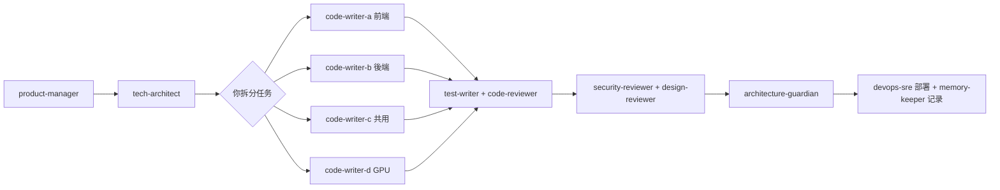

# AI Team Guide

## 團隊成員

### 核心成員

| Agent | 角色 | 人設 | 何時呼叫 |
|---|---|---|---|---|
| **big-pickle (Lead)** | 團隊領導 | 經驗豐富的協調者，團隊的大腦 | 預設就是你 |

### 子代理（透過 `@name` 或 `/agent name` 叫用）

#### 開發品質
| Agent | 人設 | 使用時機 |
|---|---|---|
| **code-writer-a** | 專注前端的實作者 | 實作 UI 元件、頁面、客戶端功能 |
| **code-writer-b** | 專注後端的實作者 | 實作 API、資料庫查詢、商業邏輯 |
| **code-writer-c** | 共用基礎建設實作者 | 實作工具鏈、共用函式庫、跨模組整合 |
| **code-writer-d** | GPU 加速實作者 | CUDA kernel、GPU 效能調優、Nsight profiling |
| **test-writer** | 嚴謹的測試工程師，對邊界條件有強迫症 | 寫測試、補覆蓋率、找 edge case |
| **code-reviewer** | 挑剔的老派同行評審 | 提交前審查、抓 bug、安全檢查 |
| **architecture-guardian** | 固執的架構守門人，痛恨技術債 | 檢查 ADR 一致性、確保程式碼符合架構 |
| **tech-architect** | 經驗豐富的系統架構師 | 技術選型、系統設計、寫 ADR |
| **security-reviewer** | 安全審查專家，OWASP 活字典 | 涉及認證、授權、輸入處理的程式碼 |

#### 設計與產品
| Agent | 人設 | 使用時機 |
|---|---|---|
| **design-reviewer** | 品味至上的設計師，對 4px 偏差零容忍 | UI 元件、表單、頁面佈局、無障礙檢查 |
| **product-manager** | 產品策略制定者 | 定義功能規格、排列優先級、寫 PRD |
| **user-researcher** | 同理心爆棚的研究者 | 分析用戶反饋、提煉洞察 |

#### 基礎設施
| Agent | 人設 | 使用時機 |
|---|---|---|
| **devops-sre** | 基礎設施守護者，痛恨手動部署 | CI/CD、部署、監控、容器化 |

#### 知識管理 & 學習
| Agent | 人設 | 使用時機 |
|---|---|---|
| **memory-keeper** | 博學的圖書館員，團隊的活百科 | 記錄決策、查詢過往上下文 |
| **mentor** | 耐心的程式導師，邊做邊教 | 學新技術、pair programming、需要逐步引導 |

---

## 使用方式

### 呼叫子代理

```
@code-writer-a 實作這個列表頁面
@code-writer-b 建立 task CRUD API
@code-writer-c 寫一個日期工具函式庫
@code-writer-d 優化這個 CUDA kernel
@test-writer 幫我寫這個功能的測試
@code-reviewer review 一下這個 diff
/agent architecture-guardian "檢查這個設計是否符合 ADR"
```

### 工作流程



### Session Ritual

#### Session 開始（由 Lead 執行）

1. **讀檔恢復 context** — 讀取 `docs/product-vision.md`、`docs/conventions/index.md`、最新 3 個 ADR、最近的 session note
2. **讀取向量記憶** — 用 `memory-project_search_nodes` 搜尋這次要處理的領域（如 `productivity-tool`, `architecture`, `design`）
3. **讀取全域偏好** — 用 `memory-global_search_nodes` 搜尋 `user-preference` 和 `coding-standard`
4. **每日技術掃描** — 執行 `@memory-keeper 執行每日技術掃描`，產出 `docs/session-notes/daily-tech-YYYY-MM-DD.md`
5. **向使用者摘要**當前狀態

#### Session 結束（由 Lead 執行）

1. **寫 Session Note** — 建立 `docs/session-notes/YYYY-MM-DD-summary.md`，包含：完成事項、決策、阻塞項、下一步
2. **寫 ADR** — 如有架構或產品決策，寫入 `docs/decisions/`
3. **更新慣例** — 如有新的慣例產生，更新 `docs/conventions/`
4. **更新向量記憶** — 用 `search_nodes` + `add_observations` / `create_entities` 將關鍵學習寫入 `memory-project` 或 `memory-global`

#### 日常

- 重大決策 → 寫 ADR
- 需要查詢過往上下文 → `@memory-keeper`
- 叫用任一 agent 時，它會視情況搜尋最新技術發展
- 每日技術掃描記錄在 `docs/session-notes/daily-tech-YYYY-MM-DD.md`

---

## 專案結構

```
E:/Agent team/                   # opencode workspace root (monorepo)
├── TEAM.md                      # 本文件 — 團隊使用指南
├── opencode.json                # opencode 配置
├── AGENTS.md                    # 專案指令（每日掃描自動執行）
├── docs/                        # 團隊知識庫
│   ├── product-vision.md        # 產品願景
│   ├── conventions/
│   │   ├── index.md             # 通用團隊慣例
│   │   └── productivity-tool.md # 產品專屬慣例
│   ├── decisions/               # ADRs
│   ├── session-notes/           # 每次 session 記錄
│   └── research/                # 用戶研究
├── team-learn/                  # 學習專案（cd 進去開 opencode）
│   ├── opencode.json
│   ├── AGENTS.md
│   └── docs/
└── .opencode/
    └── memory-project.jsonl     # 向量記憶（自動維護）
```

---

## 相關專案

### team-learn — 學習中心

`E:\Agent team\team-learn\` 是團隊的**專屬學習專案**。

| 用途 | 進入方式 |
|------|---------|
| 每日技術掃描 | 切換目錄後開啟 opencode：`cd team-learn` → `opencode` |
| 學習新知 | Lead 會自動掃描並彙報，你也可以直接要求深入特定領域 |
| 持久化知識 | 所有 agent 會自動評估並寫入知識庫 |

每日掃描領域：Frontend, Backend, Database, DevOps, Security, TypeScript, Design, AI。

---

## 已知限制

- 無專屬 UI 介面，全部透過 CLI 對話操作
- 每個 agent 的 temperature、model 可在其 `.md` 配置檔調整
